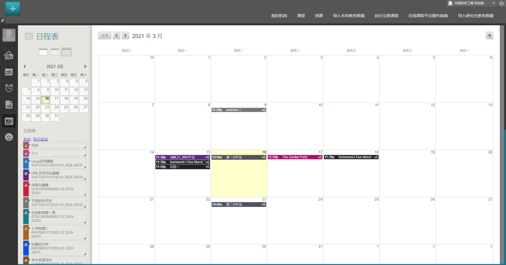
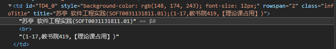

# ECNU Schedule

ECNU学生日程表，为2021年上半年软件工程实践课程项目。

## 软件功能

> 软件是给人用的。<!--给用户看的，吹得高大上一点-->

* 日程表
  * 核心功能，待办事项汇集于此。
* 课程表
  * API抓取导入：输入公共数据库账号密码，一键导入完整课程表。
  * HTML抓取导入：担心输入密码不安全？没关系，下载保存课表网页，然后直接导入——没有第三步。
  * 截图识别导入：如果还是不行……你也可以截图甚至拍照识别<del>，虽然人类现有技术还无法保证结果准确</del>。
  * 手动填写修改：当老师通知你某节课换了教室，但公共数据库没更新时，这个功能就显得格外实用。
  * 自动标注本周要上的课程：记错单双周，然后在不上课时跑去教室——都是课程表不够智能的错。
  * 导出图片：如果你有把课程表设成壁纸，或者打印出来的习惯，应该会发现——公共数据库截图的课表，字体小、排版丑、信息杂、比例还经常不合适。使用本软件，你可以自定义配色、字体、信息详略等各种细节，世界就应该如此优雅。
* 任务清单
  * 大夏学堂作业导入：不少课程会使用大夏学堂布置和提交作业。
  * 超星学习通作业导入：同上。
  * 手动录入：有些作业只会在上课时说一下，或者在群里发公告（甚至不发），这时就需要手动录入了。
* 展望未来：有时间就做，没时间就咕的功能。
  * 校历：如果能整合进日程表就好了。
  * 校车时刻表：对于跨校区的课程自动规划校车班次，美好的设想。
  * 云同步：通过公用或自建服务器，在手机、电脑等多端同步数据。
  * 选课助手：前两轮的选课意愿值推荐，第三轮的自动监视空余名额。
  * 复习提醒：可以根据考试时间自动提醒复习，包括期末考试期中考试随堂小测之类的——当然不包括突击测验。
  * 拍照归类：既然知道了上课时间，那上课时拍摄的课件之类的照片，应该可以自动归类。
  * 大夏学堂监视：有些课程在大夏学堂发布课件/公告/作业之后，就不会再通过其他渠道提醒。要么经常主动去扫视一遍修读课程，要么——写个脚本自动监视。
  * 应用推荐：有些功能已经有完美的实现，比起重复造轮子，直接把这些优质应用推荐给用户，岂不美哉？

## 预期实现

### 框架

前端使用Qt开源框架，以实现跨平台开发。

后端使用多种语言混合开发，只要不是绑定于特定平台的语言即可。

[**Qt支持的平台**](https://doc.qt.io/qt-5/supported-platforms.html)：

* Linux/X11
* Mac
* Windows
* Android
* iOS/tvOS/watchOS
* UWP

### 主界面

预计以日程表作为主界面，类似大夏学堂的日程表<del>，但绝对不会那么丑</del>。

### API抓取导入课程表

可以参考[BillChen2K/ECNU-class2ics](https://github.com/BillChen2K/ECNU-class2ics)，或者直接要求用户在[这里](https://class2ics.billc.io/index.html)获取数据之后再导入本软件。

此方法使用非常简单方便，但需要用户提供公共数据库账号与密码。

### HTML抓取导入课程表

要求用户自行打开课表后，保存网页，然后本软件读取识别HTML内容以生成课表。

此方法也比较自动化，同时不需要用户提供任何私密数据。

### 截图识别导入课程表

可以调用一些免费或付费的OCR API，如[文字识别-百度AI开放平台](https://cloud.baidu.com/product/ocr_general)。

此方法使用起来最为简单，但准确度不及以上两个抓取导入的方法。

### 手动填写修改课程表

这是最低效的方法，使用起来最为麻烦。

但有时不得不手动修改——比如周二下午的软件工程实践课程换了教室，而公共数据库的课程表并没有反应这一更改。此时以上导入方法都只能获得错误的过时数据，必须由用户手动修正。

### 导出课程表图片

> 这东西太丑了，以至于我决定自己做一个。

## 项目成员

|  姓名  |    学号     |                           Github                           |
| :----: | :---------: | :--------------------------------------------------------: |
|  黄杉  | 10195101418 |       [Apochens (chen)](https://github.com/Apochens)       |
| 刘议临 | 10195101428 |            [CCXXXI](https://github.com/CCXXXI)             |
| 章兆萌 | 10195101452 |            [zzm824](https://github.com/zzm824)             |
| 冉泓飞 | 10195101456 | [10195101456 (ranhongfei)](https://github.com/10195101456) |
| 熊国誉 | 10195101550 |    [SplendidMendax](https://github.com/SplendidMendax)     |
| 李晓晗 | 10195101560 |          [Mamboing](https://github.com/Mamboing)           |

## 立项分析

* **Usefulness**：此软件目标用户为ECNU学生。身为ECNUers，我们最了解自己的需求，可以确保这个软件是useful的。
* **Keywords**：简单、实用、效率、集合
* **Similar Apps**：功能部分重合的软件已存在不少，但有些功能不够完善，有些又太臃肿。即使所有需求都找到了合适的软件来满足，缺少数据互通也会增加使用成本。
* **Novelty**：此软件集成各种常用功能，免除了分别寻找软件并录入信息的繁琐，同时还提供了一些原创功能。
* **Ease of Test**：此软件的测试非常容易，目标用户、使用场合都极易寻找。
